# Setup of a Dell Boomi Molecule with multiple nodes on Kubernetes

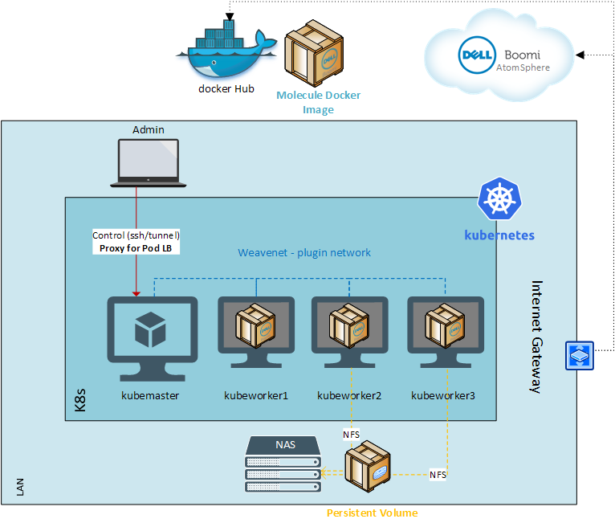

# Deployment of nfs Persistent Volume

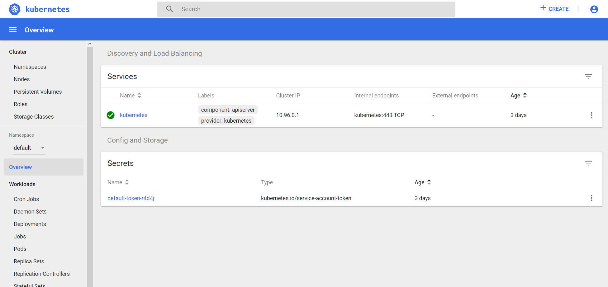

Make sure you are on "default" Namespace.

Click on “+Create” then “Create from file” and upload “nfs-volume.yaml” [here](molecule/nfs-volume.yaml?raw=true) - make sure that you update the file (replace value starting with @@@@)

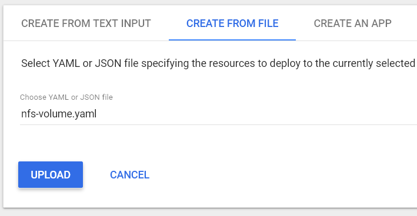

Validate that the Persistent Volume Claims is added

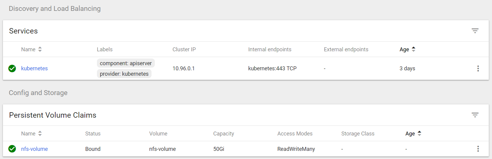

# Deployment of Boomi Molecule on Kubernetes

Make sure you are on "default" Namepace.

Click on “+Create” then “Create from fileand upload "boomi-molecule.yaml" [here](molecule/boomi-molecule.yaml?raw=true) - make sure that you update the file (replace value starting with @@@@)

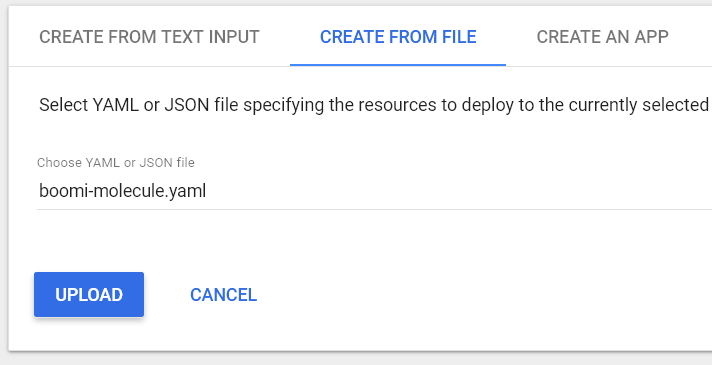

You will see the new deployment with 1 Pod requested:

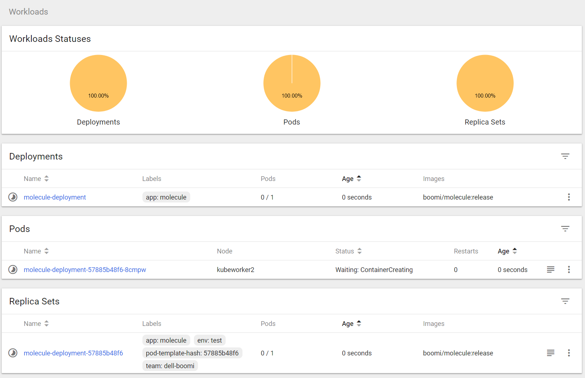

Refresh the screen

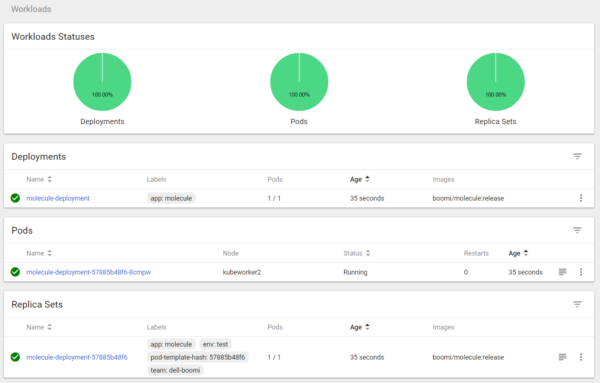

Check the content of the NFS location and the content of hosts.log

```
nas_server# ll
total 4
drwxrwxrwx 1 boomi users 70 Aug 23 10:06 .
drwxrwxrwx 1 ant users 10 Aug 19 18:28 ..
-rw-r\--r\-- 1 admin users 286 Aug 23 10:06 hosts.log
drwxr-xr-x 1 admin users 122 Aug 23 10:07 Molecule\_centos\_kubernetes
```

```
nas_server# cat hosts.log
Fri Aug 23 02:10:17 UTC 2019: Starting molecule-deployment-57885b48f6-8cmpw with IP 10.47.0.1 with user uid=0(root) gid=0(root) groups=0(root)
```


Connect to AtomSphere and check that you have a new element

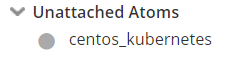

Wait for few minutes and you will see the Atom up

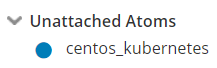

If the Atom/Molecule doesn't appear or if bullet remains gray, please check the logs Kubernetes and also the logs contained in the Shared Folder, you should have something similar:

```
nas_server# cat Molecule_centos_kubernetes/install_Molecule_centos_kubernetes.log

No suitable Java Virtual Machine could be found on your system.
Downloading JRE with wget ...
Unpacking JRE ...
Preparing JRE ...
Starting Installer ...
Warning: Java not found in the system PATH.
It may cause an issue during Atom install.
Please update your PATH environment variable.
Example:
export PATH=/path/to/jre/bin:$PATH
Authenticating credentials
The installation directory has been set to /var/boomi/Molecule_centos_kubernetes.
Retrieving Build Number
Extracting files...
Downloading JRE Files
Downloading Atom Files
Downloading Molecule Files
Retrieving Container ID
Retrieving account keystore.
Retrieving account trustore.
Configuring Molecule.
Finishing installation...
```
Attach the Molecule to an environment


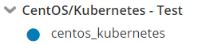

Check the cluster status

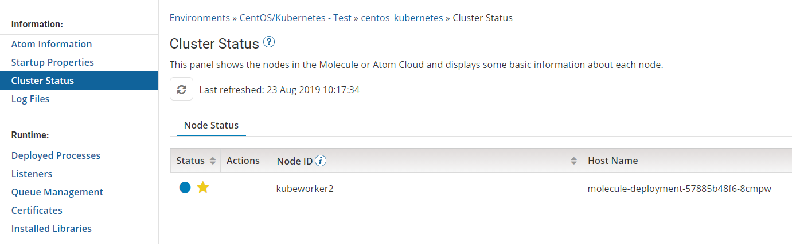

# Scaling of Boomi Molecule on Kubernetes

Return to Kubernetes Dashboard and select "Deployments" option:

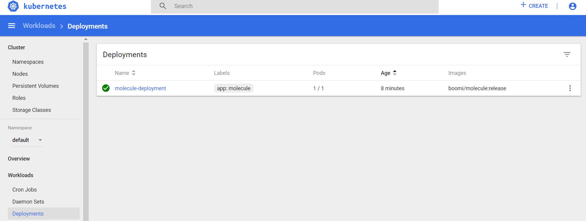

Select the right menu and "Scale"

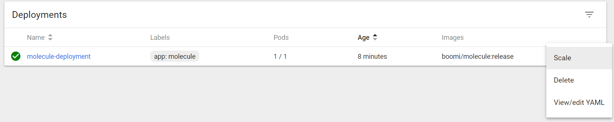

Change the number of desired pods to 3

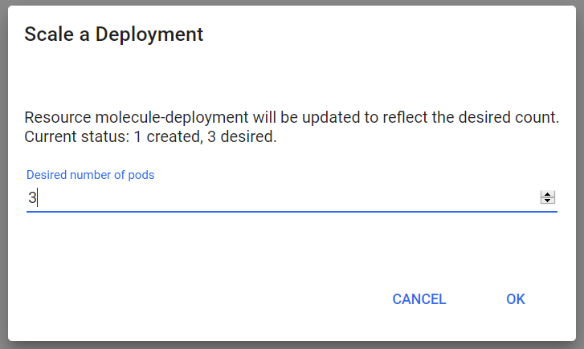

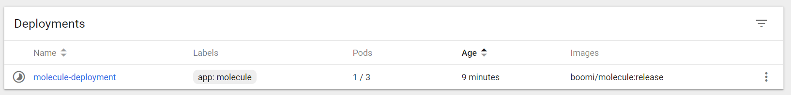

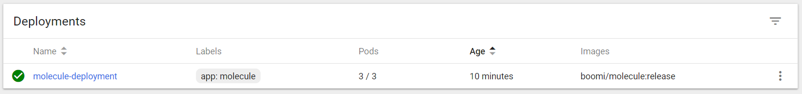

After 1 minute or two, go back AtomSphere and check the Cluster Status

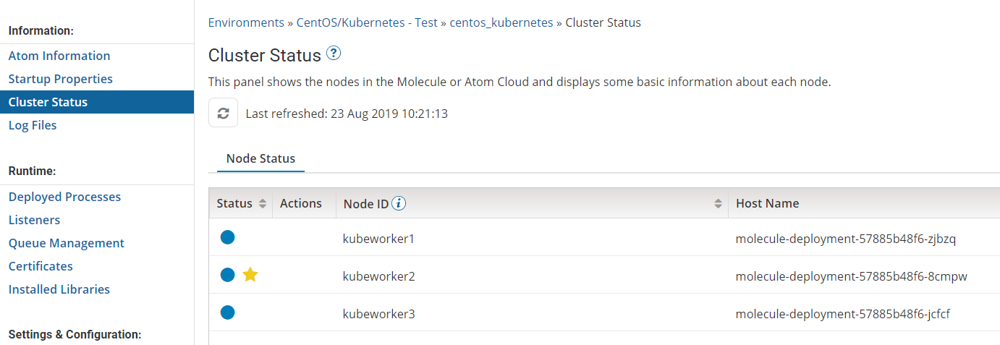

# Deployment of Dummy API and test of Load Balancing

Change the type of API Type to Advanced:

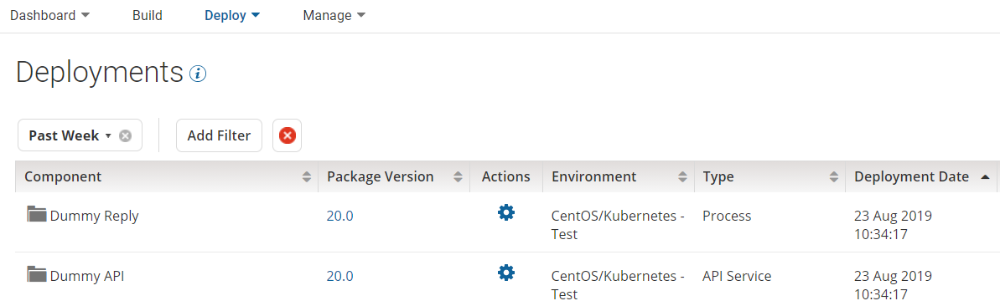

Deploy one of your API (REST or SOAP) on the environment:


Then test your API with your Browser/SOAPUI or Postman using the following URI:

<http://localhost:8001/api/v1/namespaces/default/services/http:molecule-service:9090/proxy/>\<API Resource Path\>

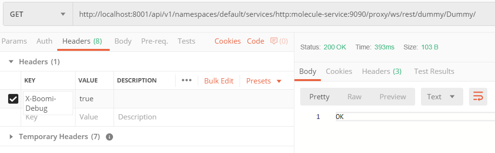

Run as many calls as the number of Pods:

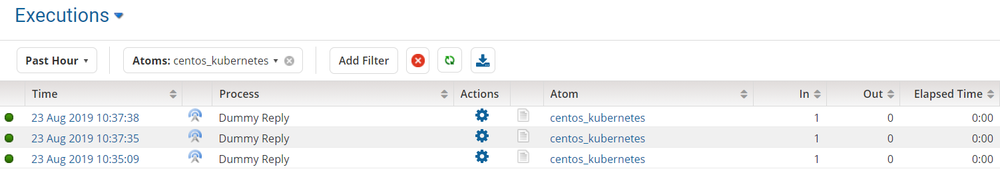

View the extended information for each call, and validate that the Node ID is changing for each call:

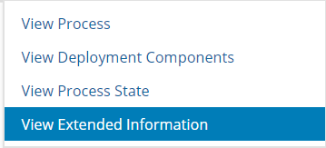

-   Extended Execution Information for 1st call: **Node ID kubeworker3**

-   Extended Execution Information for 2nd call: **Node ID kubeworker2**

-   Extended Execution Information for 3rd call: **Node ID kubeworker1**
